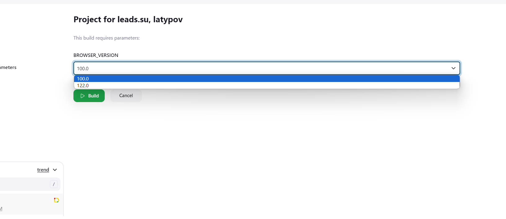
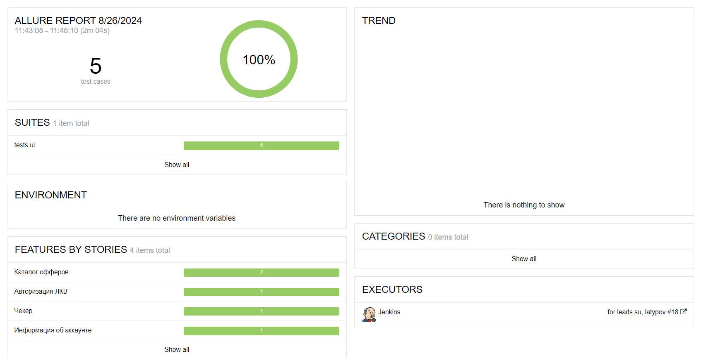
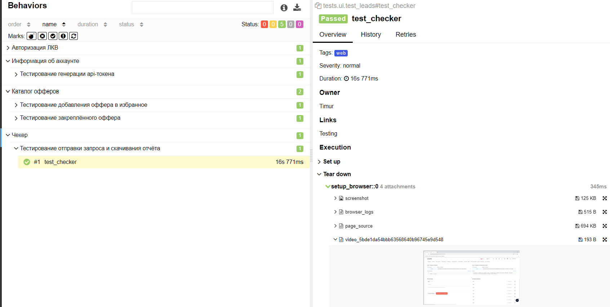
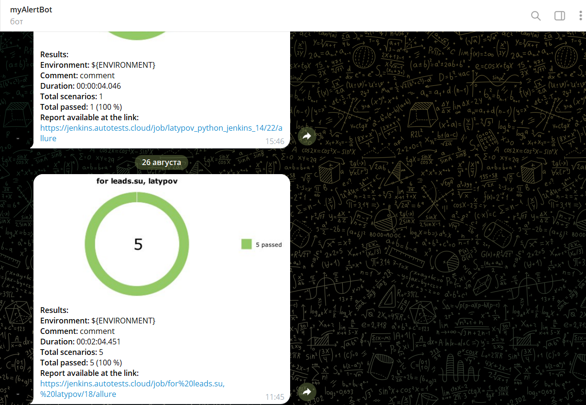
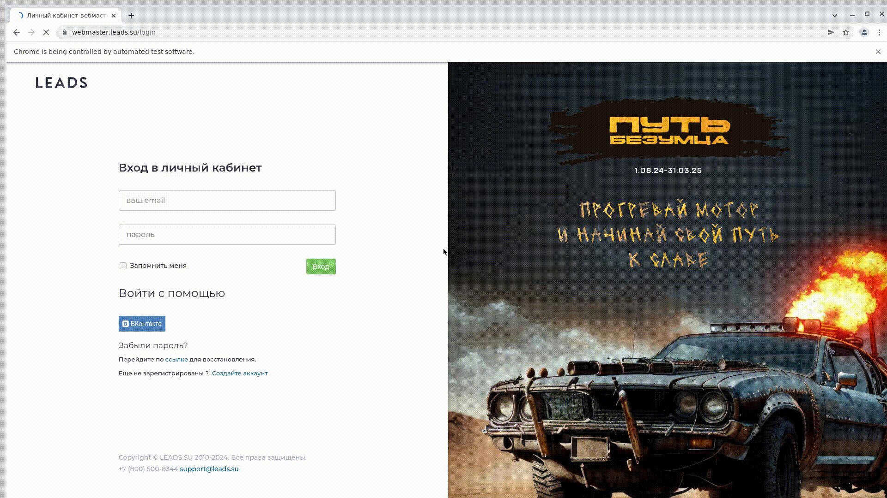

# Автоматизации тестирования LEADS.SU
<a target="_blank" href="https://leads.su/">Сайт проекта</a>

## Содержание
- [Стек](#стек)
- [Примеры UI тестов](#примеры-ui-тестов)
- [Примеры API тестов](#примеры-api-тестов)
- [Сборка](#сборка)
- [Allure отчет](#allure-отчет)
- [Отчет в Telegram](#отчет-в-telegram)
- [Видео прохождения тестов](#видео-прохождения-тестов)

## Стек

В проекте автотесты написаны на <code>Python</code> с использованием <code>Selenium</code>, <code>Selene</code> и <code>Pytest</code> для UI-тестов
>
> <code>Selenoid</code> Запускает браузеры в контейнерах <code>Docker</code>.
>
> <code>Allure Report</code> Формирует отчеты о запуске тестов.
>
> <code>Jenkins</code> Выполняет запуск самих тестов.
> После завершения прогона отправляются уведомления в <code>Telegram</code>.

## Примеры UI тестов
- Проверка входа в систему
- Проверка Создания отчёта в Checker
- Проверка добавления оффера в избранное
- Проверка генерации API-токена
- Проверка закреплённого оффера в каталоге

## Примеры API тестов
- API тесты были написаны на трекер trello.com:

- Проверка создания рабочей доски
- Проверка изменения рабочей доски
- Получение информации о рабочей доске
- Удаление рабочей доски

##  Сборка
>
> В сборке присутствуют настраиваемые параметры.
>
> Один из них - версия браузера. Сами тесты запускаются удаленно с помощью <code>Selenoid</code>

Ссылка на джобу в jenkins
https://jenkins.autotests.cloud/job/for%20leads.su,%20latypov/

## Allure отчет
>
> Allure формирует подробный отчет о прогоне тестов. Кастомные фильтры и листенеры делают отчет максимально понятным
>
> Например в отчет пишутся все селекторы и методы <code>Selene</code>, отчеты формируются по категориям, в конце приложен скриншот, видео запись прогона теста и логи.
Для API тестов полностью указаны данные запроса/ответа

## Отчет в Telegram
>
> Далее в <code>Telegram</code>чат автоматически приходит уведомление с информацией о прогоне и ссылкой на <code>Allure</code>
>

## Видео прохождения тестов
>
> <code>Selenoid</code> пишет видео прогона каждого теста и видео прикладывается в отчет <code>Allure</code>
>

